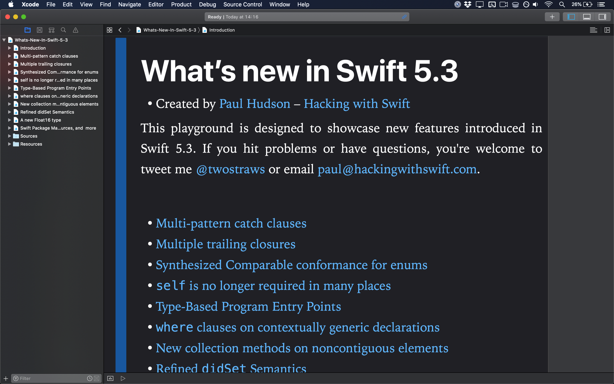

# What’s new in Swift 5.3?

This is an Xcode playground that demonstrates the new features introduced in Swift 5.3: 

* Multi-pattern catch clauses
* Multiple trailing closures
* Synthesized Comparable conformance for enums
* `self` is no longer required in many places
* Type-Based Program Entry Points
* `where` clauses on contextually generic declarations
* Enum cases as protocol witnesses
* Refined `didSet` Semantics
* A new `Float16` type
* Swift Package Manager gains binary dependencies, resources, and more

This is designed to complement my existing article [What’s New in Swift 5.3](https://www.hackingwithswift.com/articles/218/whats-new-in-swift-5-3). You might also want to read [What’s New in Swift 5.2](https://www.hackingwithswift.com/articles/212/whats-new-in-swift-5-2) and [What’s New in Swift 5.1](https://www.hackingwithswift.com/articles/182/whats-new-in-swift-5-1). Alternatively, I have a whole website dedicated to tracking [what's new in Swift](https://www.whatsnewinswift.com) – you should check it out at <https://www.whatsnewinswift.com>.

If you hit problems or have questions, you're welcome to tweet me [@twostraws](https://twitter.com/twostraws) or email <paul@hackingwithswift.com>.

